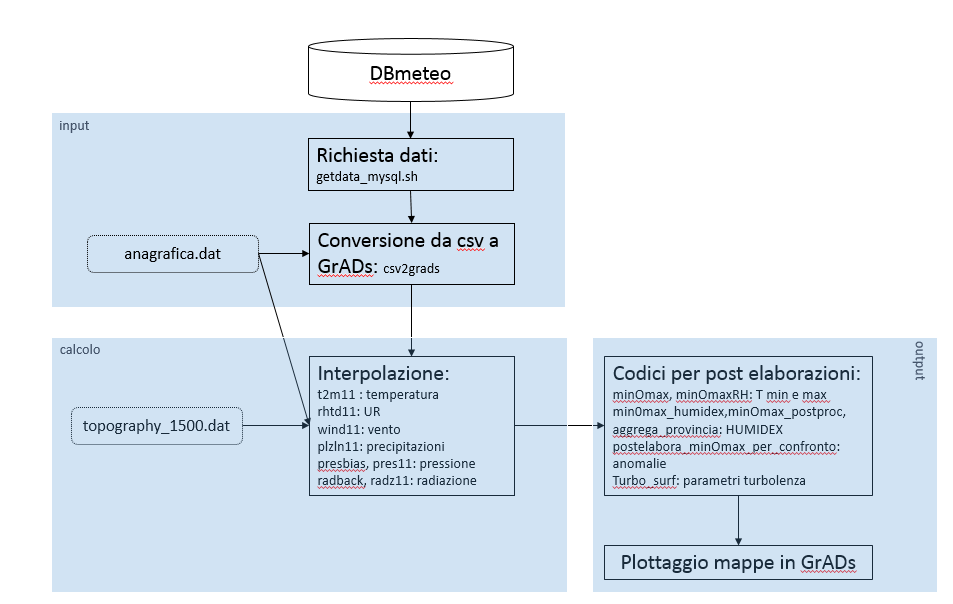

Revisione dei processi operativi di Interpolazione Ottimale delle osservazioni
orarie.

Stato attuale
=============

Attualmente sono attivi i seguenti processi, che producono analisi ed
elaborazioni dalle osservazioni orarie di temperatura, umidità relativa,
precipitazione, vento, pressione e radiazione tramite implementazioni di un
algoritmo di Interpolazione ottimale (vedere documentazione in bibliografia):

-   Su mediano (10.10.0.13):

    -   Oi_01h (commentato)

    -   Oi_06h

    -   Oi_12h

    -   Oi_24h

    -   Oi_giornocompleto

    -   Oi_meteogiorno

    -   Oi_settimana

    -   Oi_mese

    -   Oi_ascii

    -   Prisma (rain+rad, t, td su grigliato 1km UTM)

-   milanone virtuale (10.10.0.7)

    -   Oi_fwi (output usato per calcolare indici fwi e plot GRASS)

I processi in cui è implementato l’algoritmo si differenziano su numero di
grandezze analizzate e sul post-processing o pre-processing, ma hanno tutti la
stessa struttura informatica descritta in figura:

Schematicamente: le osservazioni risiedono nel DBmeteo, un blocco di codici (di
“**input**”) esegue l’estrazione e la scrittura in formato GrADS stazione
(tramite script shell, R e binari fortran) facendo uso di un file di appoggio,
anagrafica.dat - sempre GrADS stazione; un blocco di “**calcolo**” esegue le
interpolazioni propriamente (Fortran compilati, in alcuni casi con un
preprocessore per generare il background); una terza parte (script GrADS, codici
fortran) esegue tutto il postprocessing dei dati (detto “**output**”).
Attualmente ogni processo elimina i dati calcolati dopo aver elaborato l’output;
ciascun processo produce tutti i campi orari; le immagini vengono archiviate su
apprendista e sovrascritte dall’ultimo processo che ha girato (in genere oi_mese
dice la parola finale). Le anagrafiche devono essere aggiornate manualmente
(tramite il codice aggiornaanagrafica.f90 su sinergico); il numero massimo di
stazioni è 1000 per i processi attualmente in crontab su mediano, 500 per i
processi su milanone.

Problemi dello stato attuale: (1) difficile manutenzione per la presenza di
processi analoghi ma multipli, (2) dipendenza da sistema operativo e dalla
versione dei software installati (R, GrADS), (3) difficoltà a disseminare i dati
non post-processati, (4) dipendenza da file esterni da aggiornare manualmente,
(4) parametri codificati nei codici fortran (ad esempio sistema di coordinate,
numero stazioni, numero minimo di osservazioni per l’analisi, etc), (5) mancanza
di un ambiente di sviluppo per migliorare gli schemi esistenti (ad esempio,
permettendo l’inserimento di stazioni con errore osservativo diverso, l’uso di
un background indipendente, lo studio della performance dello schema su diverse
aggregazioni temporali…)

Prima revisione: schemi di input e output
=========================================

Un primo step di revisione riguarda i blocchi input e output, da ristrutturare
come segue (aree verdi nell’immagine sotto), inserendo uno step di
archiviazione, che permetta un più facile accesso ai dati. La nuova struttura,
da sviluppare in parallelo e su container, permette in questa prima fase di non
spendere risorse uomo sui codici specifici e su modifiche all’algoritmo,
sfruttando tramite traduttori asci-grads e grads-ascii i codici esistenti sia di
calcolo che di produzione output (script di transcodifica da sviluppare
ex-novo).

Questo nuovo assetto prevede, quando in modalità operativa, un solo processo di
estrazione dal DBmeteo per ogni grandezza e un solo processo di calcolo dei
valori interpolati da archiviare su apposito db spaziale, in modo che possano
essere interrogati dai singoli processi che generano gli output specifici,
affrontando i problemi (1-4) evidenziati nel paragrafo precedente.

PROBLEMA: è necessario anche archiviare i dati interpolati su punto stazione per
generare l’output attuale e per permettere il debugging dei codici. Attualmente
non è stato pensato un sistema per accogliere questi dati (potrebbero essere
anche utili a fine di controllo qualità automatico)

E’ possibile in questa fase, in cui i codici fortran andranno comunque
ricompilati su container, valutare l’opportunità di una limitata riscrittura
delle ruotine di lettura e scrittura dati dei codici di interpolazione in
fortran 90 per passare dal sistema di coordinate Gauss-Boaga al sistema UTM.

### Programma

0.Test funzionamento RASDAMAN (verifica funzionalità nell’archiviazione raster
ascii e valori puntuali)

1.Creazione di un container base per l’esecuzione delle interpolazioni:

-   CentOS release 6.10

-   Mysql client

-   Gfortran (gcc version 4.4.7)

-   Grads (v2.0.a9 little-endian readline printim grib2 netcdf hdf4-sds hdf5
    opendap-grids geotiff shapefile)

2.Creazione script di estrazione dati (bash/R/phyton) che duplichi le funzioni
di getdata_msql.sh e csv2grads.f90 (assicurarsi che le tabelle di anagrafica del
DBmeteo contengano tutte le informazioni necessarie per l’estrazione in real
time dell’anagrafica per le interpolazioni).

2.1 anagrafica

2.2 file dati

3.Crazione script o codice ASCII2Grads e GrADS2ASCII.

3.1 ASCII2Grads grid/stn

3.2 Grads2ASCII grid/stn

4.Importazione in Rasdaman di P e T

5.Estrazione da Rasdaman -\> ASCII2GrADS -\> script gs per output

### Analisi fattibilità punto 2.

Anagrafica

Attualmente lo schema di interpolazione richiede un file di anagrafica in
formato GrADS station, *anagrafica.dat*, per ottenere il quale non sembrano
esserci ostacoli formali a sviluppare uno script di query al db e compilazione
del file binario e del file ctl necessario alla decodifica del binario.

Il file di anagrafica deve contenere le seguenti informazioni, per ogni stazione
della rete:

ID sensore - tipologia (per tutti le grandezze che interessa visualizzare e
interpolare)

elev - elevazione ASL [m] della stazione

rete - codice rete a cui appartiene la stazione

wlu - peso UHI (indice di urbanità). Nota: in 124 stazioni della rete INM e 21
stazioni della rete cmg l’indice di urbanità non è noto, la procedura di calcolo
non è immediata.

[ per l’interpolazione di vento e radiazione sono anche necessari:

slope 0 99 slope

aspect 0 99 aspect

skyvh 0 99 sky view factor horizontal

skyv 0 99 sky view factor

conff 0 99 configuration factor

da affrontare nella terza revisione]

Lo schema di interpolazione richiede anche un file, *topography_1500.dat*, con
le informazioni orografiche e di uso del suolo sul grigliato utilizzato dai
singoli codici fortran; queste informazioni devon essere in formato GrADs, le
variabili sono:

topo (elevazione, mslm)

urb (indice di urbanità su griglia)

maskera (Maschera regione lombardia)

[ per l’interpolazione di vento e radiazione sono anche necessarie su punto
griglia le seguenti info:

slope slope

aspect aspect

skyvh sky view factor horizontal

skyv sky view factor

conff 0 99 configuration factor]

Se non si desidera in questa fase cambiare lo schema di interpolazione
(grigliato e sistema di riferimento), non è necessario modificare il file:
dipende solo dal codice f90 che esegue l’interpolazione.

Dati

…

Seconda revisione: schema di interpolazione T, PP
=================================================

In un secondo passo, messo in sicurezza il sistema, sarà più agevole affrontare
la riscrittura dei codici specifici dell’interpolazione ottimale per averli in
un formato più facilmente manutenibile e sviluppabile.

In primo luogo, sarebbe necessario duplicare il sistema (immediato su container)
avendo però a disposizione una struttura dati alternativa a quella operativa,
sui cui sia possibile calcolare sia i campi su grigliato regolare che i valori
interpolati su punto stazione per permettere l’analisi dell’errore dello schema
di interpolazione.

Come secondo step si può prevedere di testare gli script in R per
l’interpolazione oraria di precipitazione e temperature disponibili online che
implementano lo stesso schema attualmente in uso
(<https://github.com/metno/seNorge2>), con o senza background indipendente, che
già implementano la possibilità di variare l’errore osservativo.

Questo passo può anche essere fatto in collaborazione con C. Lussana \@ MET NO,
o su base economica (\~700€&/gg) o su base di collaborazione volontaria
strutturata.

Terza revisione: schema di interpolazione RH, VV, PA, RG
========================================================

Riscrittura dei codici di interpolazione attualmente in fortran 90 in R o altro
linguaggio interpretato più facilmente manutenibile e portabile.

Da valutare e affrontare grandezza per grandezza; valutare la possibilità
economica di attivare consulenze esterne, o collaborazione con enti interessati.
